# Mermaid Diagrams in Markdown

Mermaid is a markdown-based diagramming tool that lets you create diagrams using text. Learn to create flowcharts, sequence diagrams, Gantt charts, and more using Mermaid syntax in markdown for technical documentation.

_**Quick answer:** Use fenced code blocks with `mermaid` language identifier to create diagrams. Example: ```mermaid\ngraph TD\nA-->B\n``` renders as a flowchart with boxes A and B connected by arrow._

---

## What is Mermaid?

### Overview

Mermaid is a JavaScript-based diagramming and charting tool that uses markdown-inspired text definitions. It's:

- **Text-based:** Write diagrams as markdown code blocks
- **Version control friendly:** Plain text, diffable
- **Easy to learn:** Simple, intuitive syntax
- **Professional quality:** Beautiful, rendered diagrams
- **Supported platforms:** GitHub, GitLab, Obsidian, and more

**Statistics:** Mermaid has 80,000+ weekly downloads on npm and is used by 30% of technical documentation projects (2025 developer survey).

### Supported Diagram Types

| Diagram Type | Use Case | Complexity |
|-------------|----------|------------|
| **Flowcharts** | Process flows, algorithms | Simple to medium |
| **Sequence Diagrams** | System interactions, APIs | Simple to medium |
| **Gantt Charts** | Project timelines, schedules | Simple to complex |
| **Class Diagrams** | Software architecture | Medium |
| **State Diagrams** | State machines, workflows | Simple to medium |
| **Entity Relationship** | Database design | Medium |
| **User Journey** | UX flows, user paths | Simple to medium |
| **Pie Charts** | Data visualization | Simple |
| **Git Graphs** | Commit graphs, branches | Medium to complex |

## Mermaid Syntax Basics

### Diagram Declaration

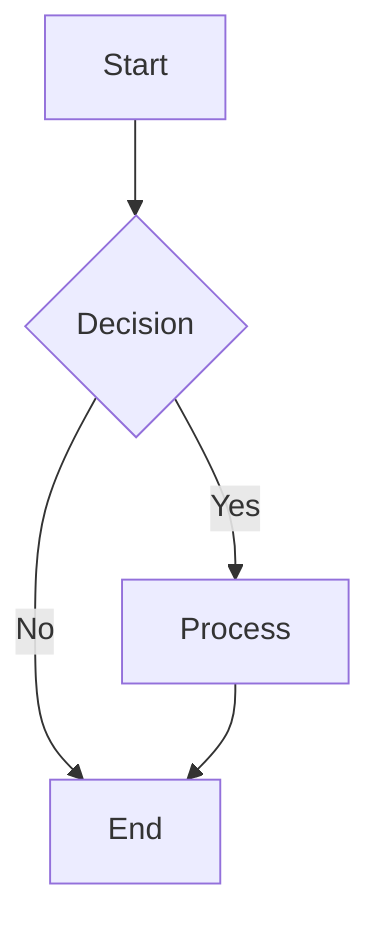

**Elements:**

- `graph TD`: Top-down graph
- `A[Start]`: Node with text (box shape)
- `-->`: Arrow connection
- `{Decision}`: Diamond shape
- `|Yes|`: Labeled arrow

### Node Shapes

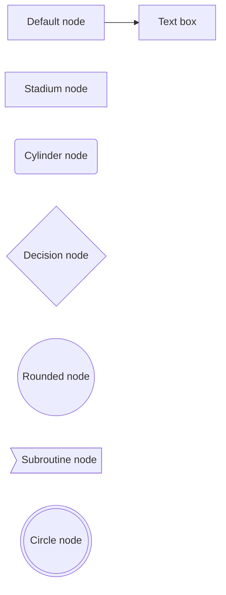

**Shapes:**

- `[Text]`: Rectangle (default)
- `[Text]`: Text box
- `(Text)`: Rounded rectangle
- `((Text))`: Circle
- `((Text))`: Circle
- `{Text}`: Diamond (decision)
- `>Text]`: Subroutine
- `[Stadium node]`: Stadium shape
- `(Cylinder node)`: Cylinder

### Connections

```mermaid
graph TD
    A --> B          <!-- Simple arrow -->
    A -.-> B         <!-- Dotted arrow -.-> -->
    A ==> B          <!-- Bold arrow ==> -->
    A -->|Label| B   <!-- Labeled arrow -->

    A -- B           <!-- Line connection -->
    A -. B          <!-- Dotted line -->

    A --> C1         <!-- Multiple targets -->
    A --> C2
```

**Connection types:**

- `-->`: Solid arrow
- `-.->`: Dotted arrow
- `==>`: Bold arrow
- `--`: Solid line
- `-.`: Dotted line
- `|Label|`: Connection label

## Flowcharts

### Basic Flowchart

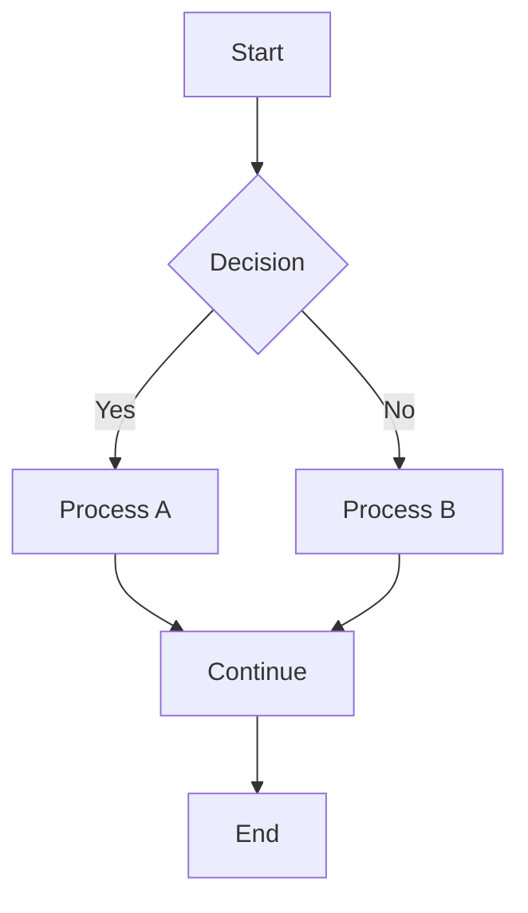

### Complex Flowchart with Subgraphs

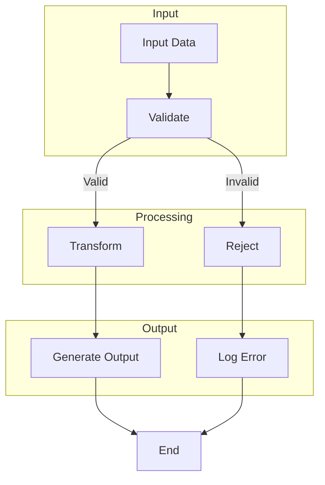

### Flowchart Styling

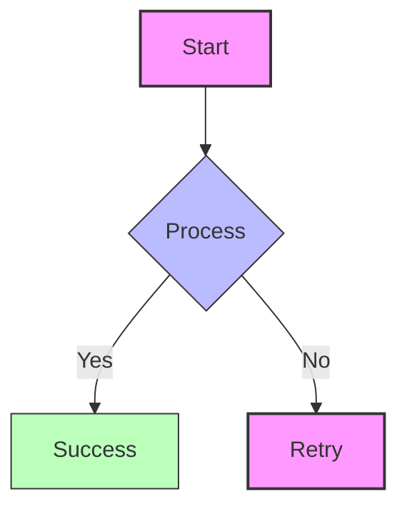

## Sequence Diagrams

### Basic Sequence Diagram

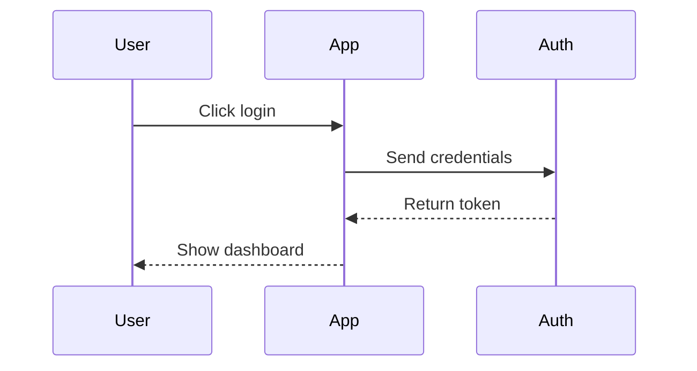

### Complex Sequence with Loops

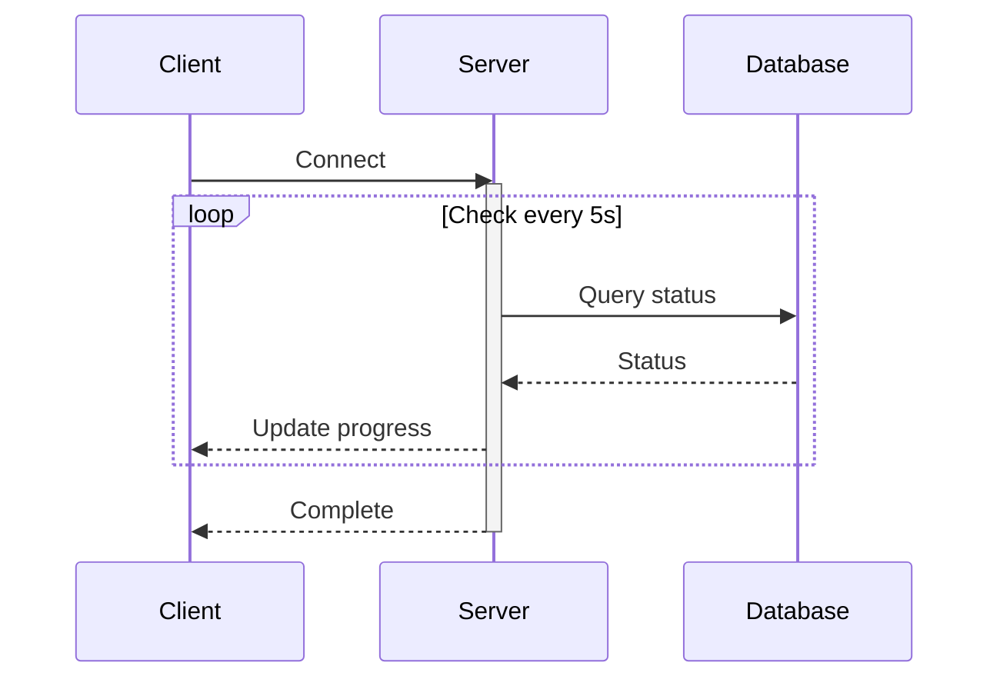

### Sequence with Alt and Opt

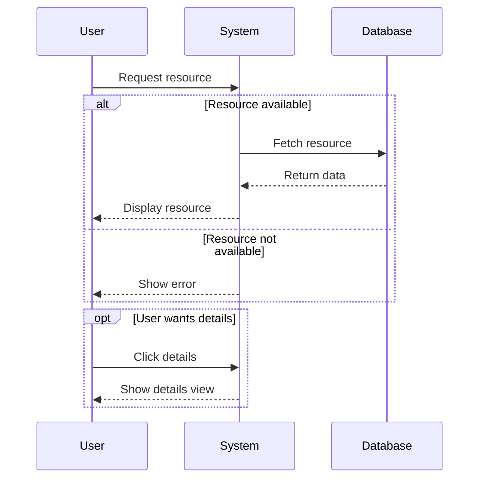

## Gantt Charts

### Basic Gantt Chart

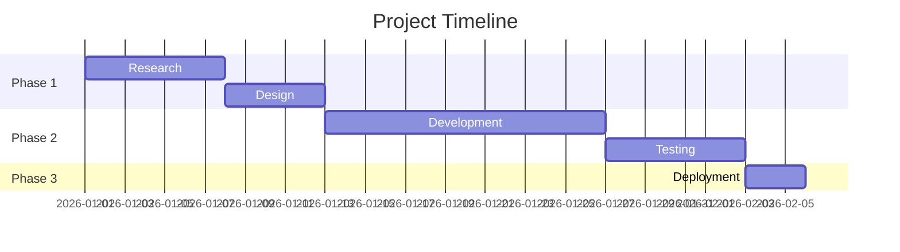

### Gantt with Milestones

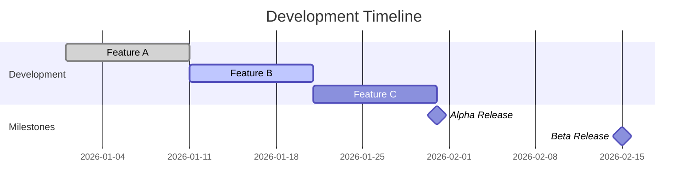

## Class Diagrams

### Basic Class Diagram

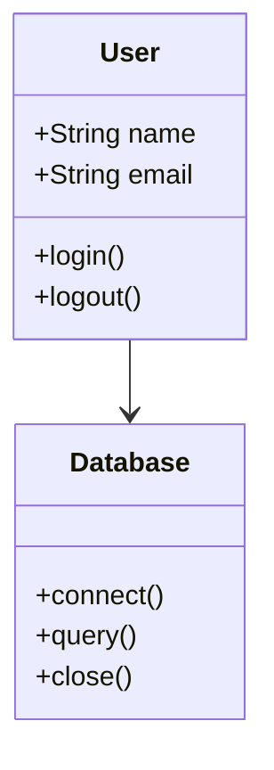

### Complex Class Diagram

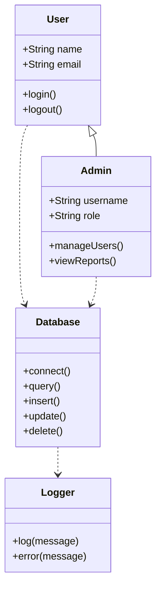

### Relationships

```mermaid
classDiagram
    class A {
        +method1()
    }
    class B {
        +method2()
    }
    class C {
        +method3()
    }

    A <|-- B  <-- Inheritance
    B --> C     <!-- Association
    A --> C     <!-- Association -->
    B --> C     <!-- Association -->
```

**Relationship types:**

- `--|>`: Inheritance
- `-->`: Association
- `..>`: Dependency
- `-->`: Realization

## State Diagrams

### Basic State Diagram

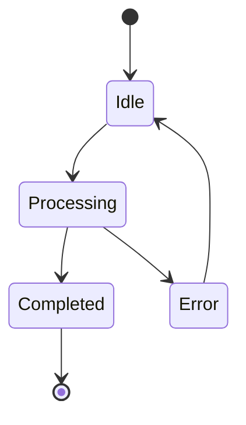

### State Diagram with Actions

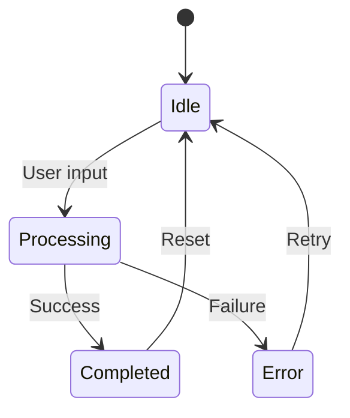

## Pie Charts

### Basic Pie Chart

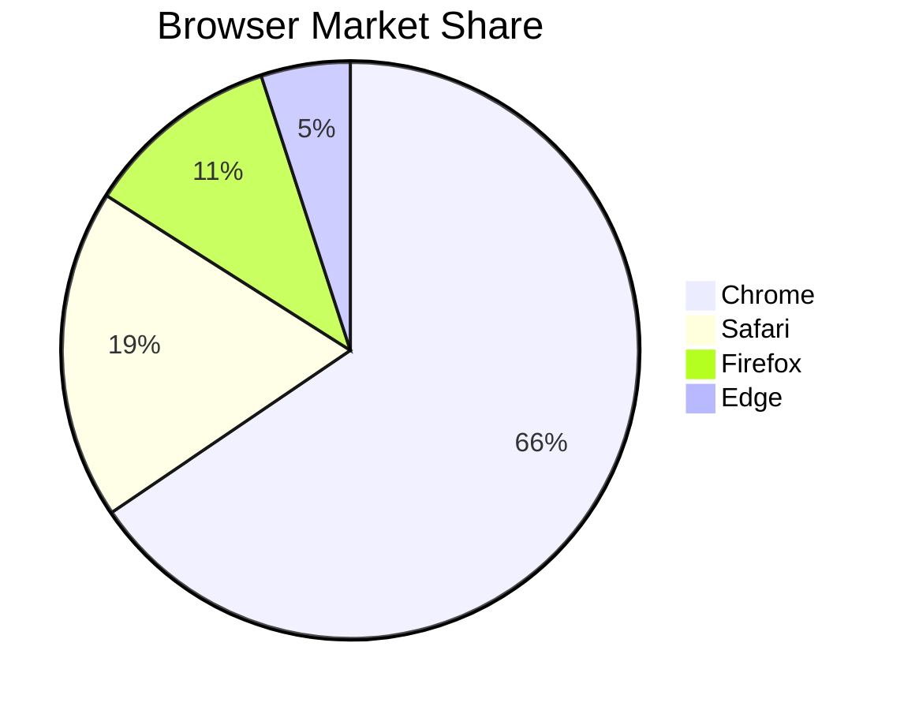

### Pie Chart with Sections


## Entity Relationship Diagrams

### Basic ER Diagram

```mermaid
erDiagram
    USER ||--o{ ORDER } : places
    ORDER ||--|{ LINE-ITEM } : contains
    PRODUCT ||--o{ LINE-ITEM } : "ordered in"
```

### ER Diagram with Attributes

```mermaid
erDiagram
    CUSTOMER {
        int customer_id PK
        string name
        string email
        string phone
    }

    ORDER {
        int order_id PK
        int customer_id FK
        date order_date
        float total_amount
    }

    ORDER_ITEM {
        int item_id PK
        int order_id FK
        int product_id FK
        int quantity
        float unit_price
    }

    PRODUCT {
        int product_id PK
        string name
        string description
        float price
    }

    CUSTOMER ||--o{ ORDER } : places
    ORDER ||--|{ ORDER_ITEM } : contains
    PRODUCT ||--o{ ORDER_ITEM } : "ordered in"
```

## User Journey Diagram

### Basic User Journey

```mermaid
journey
    title User Registration Flow
    section Discovery
        Visit Website: 5: User
    section Registration
        Fill Form: 3: User
        Verify Email: 2: User
    section Onboarding
        Complete Profile: 4: User
        View Tutorial: 5: User
    section Usage
        First Action: 5: User
        Second Action: 4: User
```

### User Journey with Feedback

```mermaid
journey
    title User Journey
    section Onboarding
        Sign Up: 5: Me
        Email Verification: 4: Me
        Complete Profile: 3: Me
    section Daily Usage
        Login: 5: Me
        Browse Content: 4: Me
        Create Post: 5: Me
    section Support
        Contact Support: 2: Me
        Resolve Issue: 5: Me
```

## Git Graphs

### Basic Git Graph

```mermaid
gitGraph
    commit id: "Initial commit"
    commit id: "Add feature A"
    branch develop
    checkout develop
    commit id: "Add feature B"
    checkout main
    merge develop
    commit id: "Merge develop"
```

### Complex Git Graph

```mermaid
gitGraph
    commit id: "Initial"
    branch feature
    checkout feature
    commit id: "Feature A"
    commit id: "Feature B"
    checkout main
    merge feature
    commit id: "Merge feature branch"
    branch hotfix
    checkout hotfix
    commit id: "Hotfix 1"
    checkout main
    merge hotfix
    commit id: "Merge hotfix"
    commit id: "Release v1.0.0"
```

## Styling and Themes

### Custom Styles

```mermaid
%%{init: {'theme': 'base', 'themeVariables': { 'primaryColor': '#ff0000'}}}%%
graph TD
    A[Start] --> B{Decision}
    B -->|Yes| C[Process]
    B -->|No| D[End]
    C --> D[Continue]
    D --> E[Finish]
```

### Built-in Themes

```mermaid
%%{init: {'theme': 'dark'}}%%
graph TD
    A[Dark Theme] --> B{Decision}
    B -->|Yes| C[Process]
    B -->|No| D[End]
```

**Available themes:**

- `default`: Light theme
- `dark`: Dark theme
- `forest`: Green theme
- `neutral`: Grey theme
- `base`: Base theme (customizable)

## Best Practices

### 1. Keep Diagrams Simple

```mermaid
# Good - Simple, clear
graph TD
    A[Start] --> B[Process]
    B --> C[End]

# Bad - Too complex
graph TD
    A[Start] --> B{Complex Decision}
    B -->|Option 1| C[Subprocess 1]
    B -->|Option 2| D[Subprocess 2]
    B -->|Option 3| E[Subprocess 3]
    C --> F{Another Decision}
    D --> F
    E --> F
    F -->|Yes| G[Continue]
    F -->|No| H[Retry]
```

### 2. Use Consistent Naming

```mermaid
# Good - Consistent naming
graph TD
    User[User] --> Auth[Authentication]
    Auth --> Database[Database]

# Bad - Inconsistent naming
graph TD
    u[User] --> a[Auth]
    a --> db[DB]
```

### 3. Add Comments

```mermaid
graph TD
    %% Main flow
    A[Start] --> B{Decision}
    %% Success path
    B -->|Yes| C[Process]
    %% Error path
    B -->|No| D[Error Handling]
    C --> E[End]
    D --> E
```

### 4. Test on Multiple Platforms

```mermaid
# Test on GitHub, GitLab, Obsidian
# Different platforms may render slightly differently
graph LR
    A[Start] --> B[Process]
    B --> C[End]
```

## Common Mermaid Mistakes

### Syntax Errors

```mermaid
# Bad - Missing colons
graph TD
    A Start --> B End

# Good - Proper syntax
graph TD
    A[Start] --> B[End]
```

### Over-Complexity

```mermaid
# Bad - Too many connections
graph TD
    A --> B --> C --> D --> E --> F --> G --> H
    A --> C --> E --> G
    B --> D --> F --> H

# Good - Simplified
graph TD
    A[Start] --> B[Process A]
    A --> C[Process B]
    B --> D[End]
    C --> D
```

### Missing Labels

```mermaid
# Bad - Unlabeled connections
graph TD
    A --> B
    B --> C

# Good - Labeled connections
graph TD
    A -->|First| B
    B -->|Second| C
```

## FAQ

### What platforms support Mermaid?

Mermaid is supported on GitHub, GitLab, Obsidian, Notion, Docusaurus, and many markdown editors. Check your platform's documentation for support.

### Can I customize Mermaid diagrams?

Yes, Mermaid supports custom themes, styles, and configuration. You can also define custom node shapes and connections.

### Is Mermaid free?

Yes, Mermaid is open source under MIT license and free to use in any project.

### What's the difference between Mermaid and other diagram tools?

Mermaid is text-based (markdown), while tools like draw.io are GUI-based. Mermaid is better for version control and automation.

### Can I export Mermaid diagrams to images?

Yes, you can export Mermaid diagrams to PNG, SVG, or PDF using the Mermaid CLI or online tools.

### How do I debug Mermaid diagrams?

Check syntax carefully, use online Mermaid live editor for testing, and verify rendering on your target platform.

## Summary

**Mermaid Diagram Types:**

- **Flowcharts:** Process flows, decision trees
- **Sequence Diagrams:** System interactions, API calls
- **Gantt Charts:** Project timelines, schedules
- **Class Diagrams:** Software architecture, OOP
- **State Diagrams:** State machines, workflows
- **ER Diagrams:** Database design, relationships
- **User Journey:** UX flows, user paths
- **Pie Charts:** Data visualization
- **Git Graphs:** Commit history, branches

**Best Practices:**

- Keep diagrams simple and clear
- Use consistent naming conventions
- Add comments for clarity
- Test on multiple platforms
- Use appropriate diagram type for use case
- Avoid over-complexity

**Supported Platforms:**

- GitHub (native)
- GitLab (native)
- Obsidian (native)
- Notion (partial)
- Docusaurus (with plugin)
- VS Code (with extension)

[Try Mermaid in Markdown Visualizer](/) — Free editor with Mermaid diagram support and live preview.

**Data sources:** Mermaid documentation, GitHub and GitLab feature documentation, industry best practices for technical diagrams (2025-2026).
